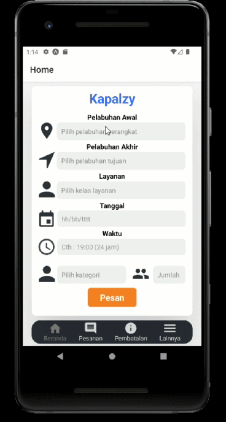
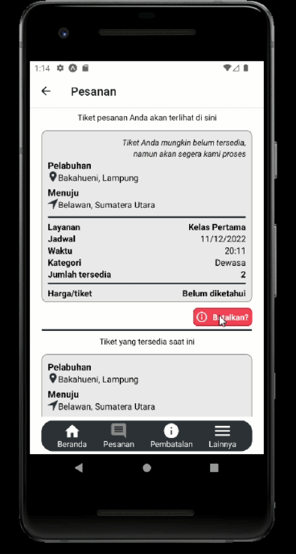

# uts-pam
Aplikasi "Kapalzy"

# Identitas Mahasiswa
Samuel Jovial Pardede - 119140104 Kelas PAM RA

# Instalasi Aplikasi
1. Mengunduh aplikasi melaui [link berikut](https://drive.google.com/file/d/16kClS_tA6P8E9oC9G73g7VgDC9QmqlLL/view?usp=sharing)
2. Sesudah aplikasi terunduh, dapat dijalankan dengan memilih pilihan "install" pada android.

# Features
# Navigation Bar
Terdapat 4 buah navigasi utama, yakni Beranda, Pesanan, Pembatalan, Lainnya

# Filling form
Pengguna dapat mengisikan detail tiket pesanan

# Buy Ticket
Form yang sudah diisi dapat dipesan

# List of Tickets
Menampilkan daftar tiket-tiket yang tersedia

# Cancel Ticket
Dapat melakukan pembatalan tiket

# Demo_Video_Links
https://youtube.com/shorts/LgiDCpakfnk?feature=share
